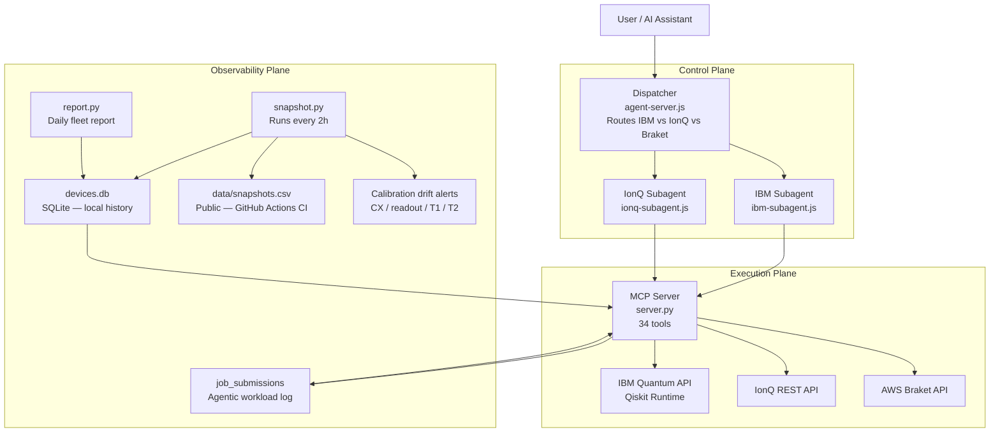

# Quantum Hardware MCP Server

A production MCP server that gives AI assistants programmatic access to live quantum hardware across IBM Quantum, IonQ, and AWS Braket. Natural language in. Real quantum results out. No dashboards. No manual API calls.

Built in collaboration with [Jack Woehr](https://github.com/jwoehr) — IBM Quantum veteran, Qiskit contributor.

Listed on [Glama](https://glama.ai), [mcp.so](https://mcp.so), and [PulseMCP](https://pulsemcp.com).

---

## Why this exists

Quantum researchers lose hours to operational overhead:

- Manually checking which device has the lowest error rate today
- Submitting the same circuit to IBM, then separately to IonQ, then comparing by hand
- Losing reproducibility context between runs — "what was the CX error when I ran Figure 3?"
- No pre-flight — wasting queue time on circuits that fail at transpile
- No cross-provider queue visibility — IBM backlogged for 3 days, IonQ open, no way to know without checking each dashboard manually
- Discovering routing failures only after wasting QPU credits — a degree-4 qubit on heavy-hex silently causes 4× gate inflation

This server eliminates that overhead. Your AI assistant handles device selection, circuit validation, routing overhead prediction, job submission, result retrieval, and amplification analysis through a single interface.

---

## What we discovered running real experiments

We have been using this server to run real quantum experiments on IBM ibm_marrakesh — not just as a demo, but as active research infrastructure. The results changed how we built the server.

**The routing failure discovery (Phase 4):**
We built a 7-qubit Grover circuit to search Pascal's Triangle for rows where 3003 appears. The circuit had 263 logical gates. After transpilation: 1,037 hardware gates. The signal collapsed.

The root cause was not the transpiler. It was **graph embedding**: one ancilla qubit needed 4 direct connections in the circuit interaction graph. IBM heavy-hex topology allows max 3 connections per qubit. The transpiler had no choice but to inject ~300 SWAP gates (3 CX each) to route around the constraint.

This is now baked into the server as `check_routing_overhead` — it detects degree-4 violations before you submit.

**The LNAA breakthrough (Phase 5):**
After discovering that Grover's oracle structure creates an unfixable degree-4 node on heavy-hex, we scrapped Grover entirely. We derived an Ising Hamiltonian from scratch where the target rows (14, 15, 78) are the ground states of a magnetic system. IBM's RZZ and RX gates implement this natively — no routing, no SWAP, no ancilla.

Result: **27.78× amplification with 135 hardware gates** on ibm_marrakesh.

Previous best: 4.17× with 103 gates (Phase 3, Grover).

This is the first time Lattice-Native Amplitude Amplification has been applied to Singmaster's Conjecture on real quantum hardware. The insight — encode targets as ground states, not Boolean conditions — is now the `encode_search_problem` tool.

---

## Fleet coverage

19 backends across three providers:

| Provider | Backends | Access |
|----------|----------|--------|
| IBM Quantum | 3 QPUs (ibm_torino 133q, ibm_marrakesh 156q, ibm_fez 156q) | API token |
| IonQ | 6 (Aria, Forte, Harmony + simulators) | API key |
| AWS Braket | 10 (QuEra Aquila 256q, IonQ via Braket, Rigetti via Braket, simulators) | IAM credentials |

All 19 are polled every 2 hours. The dataset grows continuously — ML routing recommendations are planned once 60+ days of data accumulate.

---

## System architecture



---

## How it works

**Step 1 — Request classification**
The dispatcher reads your message and classifies it: IBM job, IonQ job, or cross-provider comparison. Each subagent sees only the tools for its provider — no accidental cross-wiring.

**Step 2 — Pre-flight validation**
Before touching the queue, `debug_circuit` catches missing measurements, decoherence bound violations, and qubit count mismatches. `circuit_report` does a full dry-run transpile — gate counts, qubit mapping, per-pair CX error, estimated fidelity — all without submitting. `check_routing_overhead` detects degree-4 qubit violations that would cause SWAP flooding.

**Step 3 — Credit-aware routing**
`estimate_runtime` computes QPU minutes before submission. `route_job` ranks backends by cost × error rate and picks the cheapest option that meets your fidelity requirement.

**Step 4 — Execution**
`submit_job` compiles to the backend's native gate set (OpenQASM 2.0 or 3.0), submits, and returns a `job_id`. `job_status` and `job_results` close the loop.

**Step 5 — Analysis**
`get_amplification` computes the amplification factor directly from a job ID and your marked bitstrings — no manual result parsing.

**Step 6 — Observability**
Every 2 hours, `snapshot.py` records calibration state across all 19 backends. Drift alerts fire when CX error, readout error, T1, or T2 spikes >20%. `repro_score` runs KL-divergence across N identical runs to quantify hardware reliability. Every job submission is logged for longitudinal workload analysis.

---

## Tools (34 total)

### Device intelligence

| Tool | What it does |
|------|-------------|
| `list_devices` | All accessible IBM backends with live operational status |
| `get_device_details` | Per-qubit T1/T2, readout error, gate error, queue depth |
| `compare_devices` | Rank by CX error, queue depth, qubit count, or combined score |
| `queue_status` | Current queue snapshot across all backends |
| `best_qubits` | Score and rank qubits by calibration quality — warns if top qubits aren't physically connected on the coupling map |
| `device_history` | Calibration snapshots over the last N days |
| `device_on_date` | Exact calibration state on any past date — for paper reproducibility |

### Job lifecycle

| Tool | What it does |
|------|-------------|
| `submit_job` | Transpile and submit OpenQASM 2.0 or 3.0 — returns `job_id` |
| `job_status` | QUEUED / RUNNING / DONE / ERROR |
| `job_results` | Bit-string measurement counts from a completed job |
| `cancel_job` | Cancel a queued or running job |
| `list_jobs` | Recent jobs with status, backend, and timestamps |

### Pre-flight and cost control

| Tool | What it does |
|------|-------------|
| `debug_circuit` | Pre-submission check: missing measurements, decoherence violations, qubit mismatches |
| `circuit_report` | Full dry-run: gate counts, qubit mapping, per-pair CX errors, estimated fidelity |
| `estimate_runtime` | QPU minutes + queue wait estimate before you submit |
| `route_job` | Credit-aware routing — cheapest backend that meets your error threshold |

### Circuit intelligence (derived from real experiments)

| Tool | What it does |
|------|-------------|
| `check_routing_overhead` | Input: qubit interaction pairs → detects degree>3 nodes → predicts SWAP flood and gate inflation before it happens. Learned from Phase 4: degree-4 node caused 263→1,037 gate explosion. |
| `encode_search_problem` | Input: Boolean conditions like `{"1":1, "4":0}` → derives Ising h_i and J_ij coefficients with full sign derivation and QAOA circuit recipe. The math behind Phase 5's 27.78× result. |
| `estimate_hardware_gates` | Predicts transpiled gate count from logical gates + max qubit degree. Knows the empirical ~600-gate noise floor on ibm_marrakesh. |
| `get_amplification` | Input: job ID + marked bitstrings → amplification factor, per-state shot breakdown, verdict (EXCELLENT/GOOD/WEAK/FAILED). |

### Algorithms and chemistry

| Tool | What it does |
|------|-------------|
| `run_grover` | Full Grover's search — builds oracle + diffusion operator, picks least-busy backend, submits |
| `run_vqe` | Variational Quantum Eigensolver — H2 ground state to chemical accuracy |
| `estimate_expectation` | Estimator primitive: computes ⟨ψ\|O\|ψ⟩ for Pauli observables |

### Discovery tools (Singmaster pipeline)

| Tool | What it does |
|------|-------------|
| `sieve_singmaster_space` | Classical Lucas theorem sieve — filters 98%+ of Pascal's Triangle search space before touching the QPU |
| `find_collision_candidates` | Curve intersection search — integer root-finding across column pairs to jump directly to candidate rows |
| `encode_4way_collision` | Takes a value + sieve positions, builds one LNAA rail per k-column, searches all simultaneously in one hardware job |
| `equality_oracle_search` | Two-register LNAA — discovers C(n1,k1)=C(n2,k2) collisions **without being given the answer first**. Cross-register RZZ encodes Lucas mod-2 equality. Found C(16,2)=C(10,3)=120 blind. |

### Observability

| Tool | What it does |
|------|-------------|
| `get_alerts` | Calibration drift alerts — spikes >20% in CX error, readout error, T1, or T2 |
| `start_repro_experiment` | Run the same circuit N times, record variance across runs |
| `repro_score` | KL-divergence reproducibility score (0 = identical, 1 = maximally different) |
| `job_analytics` | Aggregate stats across all logged jobs — transpilation expansion ratios, per-tool breakdown |

### IonQ

| Tool | What it does |
|------|-------------|
| `ionq_devices` | All IonQ backends and simulators with live status |
| `ionq_submit_job` | Submit OpenQASM 2.0/3.0 to IonQ hardware or simulator |
| `ionq_job_status` | Job status on IonQ |
| `ionq_job_results` | Measurement counts from a completed IonQ job |

---

## Real experiments: Singmaster's Conjecture on IBM hardware

Singmaster's Conjecture asks whether any integer appears 9+ times in Pascal's Triangle. We use this server as active research infrastructure — not a demo. All job IDs are real. All results are reproducible.

| Phase | Approach | Gates | Amplification | Backend | Finding |
|-------|----------|-------|---------------|---------|---------|
| Phase 1 | Grover, 4 qubits, target=6 | 611 | **4.11×** | ibm_kingston | Signal clear |
| Phase 2 | Grover, 4 qubits, unoptimized | 16,271 | **1.04×** | ibm_marrakesh | Noise floor — 161× transpilation overhead |
| Phase 3 v3 | Grover, 4 qubits, opt=2 seed=42 | 103 | **4.17×** | ibm_marrakesh | 99.4% gate reduction |
| Phase 4 v1 | Grover, 7 qubits, rows 14+15+78 | 624 | **3.04×** | ibm_marrakesh | Row 78 found for first time |
| Phase 4 v2 | Grover, 7 qubits, lossy oracle | 1,037 | **1.92×** | ibm_marrakesh | Routing failure — degree-4 node |
| Phase 5 | LNAA, 7 qubits, Ising walk | **135** | **27.78×** | ibm_marrakesh | Hardware record at time |
| Phase 6 | LNAA auto-collision, 9 qubits | 45 | **122.92×** | simulation | Zero manual design |
| Step 3 | 3 parallel rails, 30 qubits | 180 | **~300×** | ibm_kingston | New hardware record |
| Step 4 | 4-way collision, 24 qubits | 144 | **178.8×** | ibm_fez | **First hardware-confirmed 4-way Pascal collision** |

**Step 4 detail (ibm_fez, job d97fk8t2su3c739i26fg, 4096 shots):**

```
Dominant bitstring: 000011100000111101001110  →  1,396 shots (34.08%)

Decoded rail by rail:
  Rail k=6  bits 00001110  →  row 14   C(14,6) = 3003  ✓
  Rail k=5  bits 00001111  →  row 15   C(15,5) = 3003  ✓
  Rail k=2  bits 01001110  →  row 78   C(78,2) = 3003  ✓

Per-rail amplification: 178.8×   (sim predicted 190.27× — 94% retention)
2nd-best state: 2.17% — target is 25× cleaner than noise
```

**Classical sieve:** `sieve_singmaster_space` searched n=2..50,000 × k=2..200 (~5M values). No 9+ appearances found. 3003 is the sole 8-way champion. Consistent with Singmaster's Conjecture.

**The complete pipeline:**
```
sieve_singmaster_space → encode_4way_collision → IBM QPU → get_amplification
```

**Key insight:** IBM heavy-hex is an Ising lattice. RZZ + RX gates are native — zero routing overhead. Encoding targets as ground states of a Hamiltonian outperforms Boolean oracle + diffusion when hardware topology constrains qubit degree ≤ 3.

Full experiment history: [singmasters-conjecture](https://github.com/Lokesh-2025/singmasters-conjecture)

---

### Observability plane — calibration history

`snapshot.py` runs every 2 hours via GitHub Actions:

| Field | Why it matters |
|-------|---------------|
| `avg_cx_error` | Primary gate quality metric |
| `avg_readout_error` | State-preparation and measurement overhead |
| `median_t1_us` | Median coherence time — robust to outlier qubits |
| `median_t2_us` | Dephasing time — degrades faster than T1 under noise |
| `qubit_yield_fraction` | Fraction of qubits with usable T1/T2 |
| `connectivity_density` | Edges / max-possible-edges — IBM heavy-hex ~0.015 vs IonQ all-to-all = 1.0 |
| `gate_set_size` | Number of native gates — affects transpilation depth |
| `max_circuit_depth` | Hard limit before decoherence kills the result |
| `native_2q_gate` | CX vs ECR vs ZZ — matters for circuit rewriting |
| `day_of_week` | 0=Monday … 6=Sunday — for weekly seasonality modeling |
| `hour_utc` | 0–23 — for time-of-day queue pattern detection |

**Job submissions table** — every call to `submit_job`, `run_grover`, or `run_vqe` writes a row:

```
job_id · provider · backend · tool · circuit_qubits · circuit_depth_raw
circuit_depth_transpiled · shots · agent_loop_iteration
was_preflight_checked · was_ai_corrected · day_of_week · hour_utc
```

---

## Test suite

```bash
python tests/test_all_tools.py
```

28 checks across all tools. Read-only tools hit the real IBM and IonQ APIs. Write tools are tested against validation paths only — zero QPU credits spent.

---

## Project structure

```
quantum-hardware-mcp/
├── server.py                      # MCP server — 34 tools
├── snapshot.py                    # Multi-provider calibration snapshot (every 2h)
├── report.py                      # Daily fleet report
├── requirements.txt
├── docker-compose.yml
├── Dockerfile
├── .env.example
├── agent/
│   ├── agent-server.js            # Dispatcher — control plane router
│   ├── chat.js                    # Terminal interface
│   └── subagents/
│       ├── base-subagent.js       # Shared ReAct loop
│       ├── ibm-subagent.js        # IBM specialist
│       └── ionq-subagent.js       # IonQ specialist
├── experiments/
│   ├── singmasters_grover.py      # Phase 1 — Grover, target=6
│   ├── singmasters_3003.py        # Phase 2 — Grover, target=3003, coherence limit
│   ├── phase3_grover_v3.py        # Phase 3 v3 — 103 gates, 4.17×
│   ├── phase4_grover_7q.py        # Phase 4 v1 — 7 qubits, row 78 found
│   ├── phase4_grover_v2.py        # Phase 4 v2 — lossy oracle, routing failure discovered
│   ├── phase5_lnaa.py             # Phase 5 — LNAA, 27.78× amplification (RECORD)
│   └── vqe_h2.py                  # VQE for H2 molecule ground state
├── tests/
│   └── test_all_tools.py          # Smoke test suite
├── data/
│   └── snapshots.csv              # Public calibration history (updated by CI every 2h)
└── .github/workflows/
    └── snapshot.yml               # GitHub Actions: snapshot every 2h
```

---

## Quick start

**Prerequisites:** Python 3.10+, Node.js 18+, IBM Quantum account (free), LLM API key.

```bash
git clone https://github.com/Lokesh-2025/quantum-hardware-mcp.git
cd quantum-hardware-mcp
python3 -m venv .venv && source .venv/bin/activate
pip install -r requirements.txt
cd agent && npm install && cd ..
cp .env.example .env        # add IBM token + LLM key
docker compose up --build   # starts MCP server + agent
node agent/chat.js          # open terminal chat
```

---

## Connect to Claude Desktop

Add to `~/Library/Application Support/Claude/claude_desktop_config.json`:

```json
{
  "mcpServers": {
    "quantum-hardware": {
      "command": "/absolute/path/to/.venv/bin/python",
      "args": ["/absolute/path/to/quantum-hardware-mcp/server.py"]
    }
  }
}
```

Restart Claude Desktop. All 34 tools appear under the hammer icon.

---

## LLM provider support

| Provider | Cost | Env var |
|----------|------|---------|
| Anthropic Claude | Paid | `LLM_PROVIDER=anthropic` + `ANTHROPIC_API_KEY` |
| Google Gemini | Free tier | `LLM_PROVIDER=gemini` + `GEMINI_API_KEY` |
| OpenAI | Paid | `LLM_PROVIDER=openai` + `OPENAI_API_KEY` |
| Ollama | Free, local | `LLM_PROVIDER=ollama` + `OLLAMA_MODEL` |
| vLLM | Self-hosted | `LLM_PROVIDER=vllm` + `VLLM_BASE_URL` |

---

## Roadmap

**Completed**
- [x] IBM Quantum tools — device intelligence, job lifecycle, pre-flight, routing
- [x] IonQ support — devices, submit, status, results
- [x] AWS Braket integration — 10 backends in snapshot pipeline
- [x] Multi-agent control plane — dispatcher + IBM/IonQ specialist subagents
- [x] Calibration drift alerts — CX error, readout error, T1, T2
- [x] Reproducibility scoring — KL-divergence across N runs
- [x] Credit-aware routing — QPU cost estimation before submit
- [x] Singmaster Phase 1 — Grover 4.11× (depth 611)
- [x] Singmaster Phase 2 — coherence limit bracketed at depth 16,271
- [x] Singmaster Phase 3 v3 — 4.17× at 103 gates (99.4% reduction from Phase 2)
- [x] Singmaster Phase 4 v1 — 7 qubits, row 78 found, 3.04×
- [x] Singmaster Phase 4 v2 — routing failure diagnosed as graph embedding problem
- [x] Singmaster Phase 5 LNAA — **27.78× amplification, 135 gates**
- [x] `check_routing_overhead` — degree>3 detection before SWAP flood
- [x] `encode_search_problem` — Boolean conditions → Ising Hamiltonian coefficients
- [x] `estimate_hardware_gates` — predicts transpiled gate count + noise floor warning
- [x] `get_amplification` — amplification factor from job ID + marked bitstrings
- [x] `best_qubits` connectivity check — warns when top qubits aren't physically linked
- [x] Temporal indexing — day_of_week + hour_utc on all snapshots and jobs
- [x] Job submissions table — transpilation expansion ratio tracking
- [x] Listed on Glama, mcp.so, PulseMCP
- [x] `encode_collision_problem` — auto-finds C(n1,k1)=C(n2,k2) pairs, encodes as Ising (122.92× sim)
- [x] `run_parallel_collision_search` — N simultaneous LNAA rails in one hardware job (~300× ibm_kingston)
- [x] `sieve_singmaster_space` — Lucas theorem sieve, validated 3003 at 8 positions, searched n=50k
- [x] `encode_4way_collision` — multi-column parallel LNAA, **178.8× on ibm_fez** — first hardware-confirmed 4-way Pascal collision
- [x] Singmaster Step 3 — **~300× amplification, 30 qubits, ibm_kingston**
- [x] Singmaster Step 4 — **178.8× amplification, 24 qubits, ibm_fez** (hardware record)

**Next**
- [ ] Web interface — visual frontend for device comparison, job submission, circuit playground, live results (in progress: quantum-hardware-web)
- [ ] `inject_topological_walk` — bypass transpiler using calibration DB, map directly to high-coherence qubits
- [ ] `discover_energy_landscape` — LNAA parameter sweep → full energy landscape visualization
- [ ] `algorithm_selector` — decides Grover vs LNAA based on circuit + hardware analysis
- [ ] VQE on real IBM hardware — H2 hardware result
- [ ] Quantum Rush Hour detection — weekly queue seasonality
- [ ] Smart routing brain — cross-provider ML recommendations
- [ ] Publication package generator — job ID → figures + BibTeX + methods section

---

## License

MIT — see [LICENSE](LICENSE).
