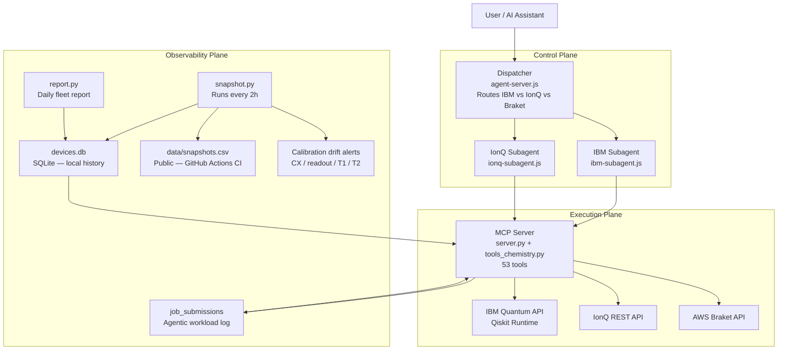

# Quantum Hardware MCP Server

A quantum hardware orchestration and intelligence layer that gives AI agents the ability to select, validate, execute, and analyze quantum experiments across multiple providers. Natural language in. Real quantum results out. No dashboards. No manual API calls.

Built in collaboration with [Jack Woehr](https://github.com/jwoehr) — IBM Quantum veteran, Qiskit contributor.

---

## Why this exists

Quantum researchers lose hours to operational overhead:

- Manually checking which device has the lowest error rate today
- Submitting the same circuit to IBM, then separately to IonQ, then comparing by hand
- Losing reproducibility context between runs — "what was the CX error when I ran Figure 3?"
- No pre-flight — wasting queue time on circuits that fail at transpile
- No cross-provider queue visibility — IBM backlogged for 3 days, IonQ open, no way to know without checking each dashboard manually
- Discovering routing failures only after wasting QPU credits — a degree-4 qubit on heavy-hex silently causes 4× gate inflation

This server eliminates that overhead. Your AI assistant handles device selection, circuit validation, routing overhead prediction, job submission, result retrieval, and amplification analysis through a single interface.

---

## What we discovered running real experiments

We have been using this server to run real quantum experiments on IBM ibm_marrakesh — not just as a demo, but as active research infrastructure. The results changed how we built the server.

**The routing failure discovery (Phase 4):**
We built a 7-qubit Grover circuit to search Pascal's Triangle for rows where 3003 appears. The circuit had 263 logical gates. After transpilation: 1,037 hardware gates. The signal collapsed.

The root cause was not the transpiler. It was **graph embedding**: one ancilla qubit needed 4 direct connections in the circuit interaction graph. IBM heavy-hex topology allows max 3 connections per qubit. The transpiler had no choice but to inject ~300 SWAP gates (3 CX each) to route around the constraint.

This is now baked into the server as `check_routing_overhead` — it detects degree-4 violations before you submit.

**The LNAA approach (Phase 5):**
After discovering that Grover's oracle structure creates an unfixable degree-4 node on heavy-hex, we scrapped Grover entirely. Instead of a Boolean oracle, we built an Ising Hamiltonian — the same encoding family behind QAOA and quantum annealing — where target rows (14, 15, 78, found classically via the Lucas-theorem sieve beforehand) are the ground states. IBM's RZZ and RX gates implement this natively — no routing, no SWAP, no ancilla.

Result: **27.78× amplitude amplification, preparing and confirming those already-known target states, with 135 hardware gates** on ibm_marrakesh.

Previous best: 4.17× with 103 gates (Phase 3, Grover).

Important honesty note: the sieve (classical, microseconds) finds *which* rows collide. The quantum circuit doesn't discover that fact — it demonstrates that a hardware-native encoding can prepare and amplify those known target states without routing overhead, at scale, in one job. That's a real result about circuit design and hardware efficiency, not a mathematical discovery. We call the technique LNAA (Lattice-Native Amplitude Amplification) as a name for this specific application of Ising-Hamiltonian encoding to Pascal's Triangle collision search — the underlying math (Ising embeddings, native-gate execution) is well-established, not new. The insight worth keeping — encode targets as ground states, not Boolean conditions, so the circuit matches the hardware's native connectivity — is now the `encode_search_problem` tool.

---

## Fleet coverage

19 backends across three providers:

| Provider | Backends | Access |
|----------|----------|--------|
| IBM Quantum | 3 QPUs (ibm_torino 133q, ibm_marrakesh 156q, ibm_fez 156q) | API token |
| IonQ | 6 registered (Harmony + both Aria retired; Forte-1 and Forte-Enterprise-1 available; simulator active) | API key |
| AWS Braket | 10 (QuEra Aquila 256q, IonQ via Braket, Rigetti via Braket, simulators) | IAM credentials |

All 19 are polled every 2 hours. The dataset grows continuously — ML routing recommendations are planned once 60+ days of data accumulate.

---

## System architecture



---

## How it works

**Step 1 — Request classification**
The dispatcher reads your message and classifies it: IBM job, IonQ job, or cross-provider comparison. Each subagent sees only the tools for its provider — no accidental cross-wiring.

**Step 2 — Pre-flight validation**
Before touching the queue, `debug_circuit` catches missing measurements, decoherence bound violations, and qubit count mismatches. `circuit_report` does a full dry-run transpile — gate counts, qubit mapping, per-pair CX error, estimated fidelity — all without submitting. `check_routing_overhead` detects degree-4 qubit violations that would cause SWAP flooding.

**Step 3 — Credit-aware routing**
`estimate_runtime` computes QPU minutes before submission. `route_job` ranks backends by cost × error rate and picks the cheapest option that meets your fidelity requirement.

**Step 4 — Execution**
`submit_job` compiles to the backend's native gate set (OpenQASM 2.0 or 3.0), submits, and returns a `job_id`. `job_status` and `job_results` close the loop.

**Step 5 — Analysis**
`get_amplification` computes the amplification factor directly from a job ID and your marked bitstrings — no manual result parsing.

**Step 6 — Observability**
Every 2 hours, `snapshot.py` records calibration state across all 19 backends. Drift alerts fire when CX error, readout error, T1, or T2 spikes >20%. `repro_score` runs KL-divergence across N identical runs to quantify hardware reliability. Every job submission is logged for longitudinal workload analysis.

---

## Tools (52 total)

### Device intelligence

| Tool | What it does |
|------|-------------|
| `list_devices` | All accessible IBM backends with live operational status |
| `get_device_details` | Per-qubit T1/T2, readout error, gate error, queue depth |
| `compare_devices` | Rank by CX error, queue depth, qubit count, or combined score |
| `queue_status` | Current queue snapshot across all backends |
| `best_qubits` | Score and rank qubits by calibration quality — warns if top qubits aren't physically connected on the coupling map |
| `device_history` | Calibration snapshots over the last N days |
| `device_on_date` | Exact calibration state on any past date — for paper reproducibility |

### Quantum chemistry planning (`qforge`)

The tools above answer *"what hardware exists, and is my circuit valid?"*. These
answer the question a chemist starts with: *"I have this molecule — can I run it,
by what method, and what will it cost?"* All values are computed from geometry by
the [`qforge`](qforge/) library in this repo; nothing is looked up.

| Tool | What it does |
| ---- | ------------ |
| `analyze_molecule` | Builds the qubit Hamiltonian from atom positions and reports how far entanglement forging and Pauli grouping cut the problem down — plus the accuracy floor at each truncation rank |
| `plan_quantum_chemistry_run` | Given a molecule and a budget, works out the most accurate result you can actually buy: Schmidt rank, circuit count, cost, expected error |
| `recommend_error_mitigation` | Which mitigation techniques are worth applying for a given circuit and device noise — including the ones measured **not** to help, so you skip them |
| `estimate_circuit_error_ceiling` | Bounds the error on *any* observable from one fidelity number, so you can tell before running whether a job can possibly reach chemical accuracy |
| `build_forged_circuits` | Emits the actual OpenQASM circuits for a forged ground-state calculation — each acting on **half** the qubits the molecule would otherwise need — plus a simulator self-check confirming they reconstruct the right energy |
| `run_forged_energy` | Builds the circuits and submits them to a named device via `submit_job`, returning ordered job IDs |
| `collect_forged_energy` | Fetches the finished jobs and reconstructs the molecular energy, compared against the exact classical answer |

The last three complete the loop: **molecule → circuits → hardware → energy**.

```
run_forged_energy(atoms="H 0 0 0; H 0 0 0.74", n_electrons=2,
                  device_name="ibm_fez", schmidt_rank=2)
→ 8 circuits on 2 qubits (H2 would otherwise need 4), job IDs returned
collect_forged_energy(..., job_ids="...")
→ measured energy vs exact −1.137284 Ha
```

Circuits are replayed on a local simulator before anything is submitted — a
wrong measurement basis or sign produces a quietly wrong energy rather than an
obvious failure, so `run_forged_energy` refuses to submit if the self-check
fails. Job counts are capped by default; raise `max_circuits` deliberately.

Example — *"can I run H4 on $3,000 of credits?"*:

```
plan_quantum_chemistry_run(
    atoms="H 0 0 0; H 1 0 0; H 2 0 0; H 3 0 0",
    n_electrons=4,
    budget_usd=3000,
)
→ Schmidt rank 4: 80 circuits, ~$2,063, floor 1.53 kcal/mol
```

Requires `qiskit-nature` (in `requirements.txt`). The tools import lazily, so the
rest of the server still runs if it is missing.

### Job lifecycle

| Tool | What it does |
|------|-------------|
| `submit_job` | Transpile and submit OpenQASM 2.0 or 3.0 — returns `job_id` |
| `job_status` | QUEUED / RUNNING / DONE / ERROR |
| `job_results` | Bit-string measurement counts from a completed job |
| `cancel_job` | Cancel a queued or running job |
| `list_jobs` | Recent jobs with status, backend, and timestamps |

### Pre-flight and cost control

| Tool | What it does |
|------|-------------|
| `debug_circuit` | Pre-submission check: missing measurements, decoherence violations, qubit mismatches |
| `circuit_report` | Full dry-run: gate counts, qubit mapping, per-pair CX errors, estimated fidelity |
| `estimate_runtime` | QPU minutes + queue wait estimate before you submit |
| `route_job` | Credit-aware routing — cheapest backend that meets your error threshold |
| Automatic drift gate (`submit_job`, `ionq_submit_job`) | Before any real submission, both tools automatically check the target device's calibration history for a real alert (error spike >20%, T1/T2 drop, or went offline) in the last 24 hours — no separate `get_alerts` call needed. Blocks by default with `confirm_despite_drift_alert=True` to override, same shape as `confirm_real_hardware`. |
| `check_chip_identity` | Detects a silent hardware swap or qubit relabeling — the physical chip behind a device name changed, or its qubit indices got reassigned, neither of which any public API states directly. Built on a real per-qubit/per-pair calibration archive (`qubit_snapshots`/`pair_snapshots`), backfilled from IBM's own history back to each device's online_date. Verdict is calibrated against real observed correlation-decay-vs-time-gap on `ibm_fez`'s own 831-day history, not a fixed guess. |
| `verify_stabilizer_circuit` | Exact measurement distribution for any Clifford-only circuit (H, S, CX, CZ, ...) via the stabilizer tableau — not simulated, not estimated, exact, and scales to hundreds of qubits (Gottesman-Knill theorem). Confirmed: a 150-qubit Clifford circuit verifies in under a second, where state-vector simulation would need 2^150 amplitudes and is physically impossible |
| `verify_stabilizer_hardware_result` | Verifies real hardware measurement counts against a Clifford circuit's exact stabilizer prediction — a real fidelity lower bound at any qubit count, no simulation required |

### Circuit intelligence (derived from real experiments)

| Tool | What it does |
|------|-------------|
| `check_routing_overhead` | Input: qubit interaction pairs → detects degree>3 nodes → predicts SWAP flood and gate inflation before it happens. Learned from Phase 4: degree-4 node caused 263→1,037 gate explosion. |
| `encode_search_problem` | Input: Boolean conditions like `{"1":1, "4":0}` → derives Ising h_i and J_ij coefficients with full sign derivation and QAOA circuit recipe. The math behind Phase 5's 27.78× result. |
| `estimate_hardware_gates` | Predicts transpiled gate count from logical gates + max qubit degree. Knows the empirical ~600-gate noise floor on ibm_marrakesh. |
| `get_amplification` | Input: job ID + marked bitstrings → amplification factor, per-state shot breakdown, verdict (EXCELLENT/GOOD/WEAK/FAILED). |

### Algorithms and chemistry

| Tool | What it does |
|------|-------------|
| `run_grover` | Full Grover's search — builds oracle + diffusion operator, picks least-busy backend, submits |
| `run_vqe` | Variational Quantum Eigensolver — H2 ground state to chemical accuracy |
| `estimate_expectation` | Estimator primitive: computes ⟨ψ\|O\|ψ⟩ for Pauli observables |

### Discovery tools (Singmaster pipeline)

| Tool | What it does |
|------|-------------|
| `sieve_singmaster_space` | Classical Lucas theorem sieve — filters 98%+ of Pascal's Triangle search space before touching the QPU |
| `find_collision_candidates` | Curve intersection search — integer root-finding across column pairs to jump directly to candidate rows |
| `encode_4way_collision` | Takes a value + sieve positions, builds one LNAA rail per k-column, searches all simultaneously in one hardware job |
| `equality_oracle_search` | Two-register LNAA — amplifies (n1, n2) pairs matching a Lucas mod-2 parity oracle (cross-register RZZ), without being told which rows to look for. Parity match is a weak, ~50%-hit-rate filter, not proof of equality — classical post-processing (`comb()`) checks every measured pair for true equality. Confirmed C(16,2)=C(10,3)=120 this way. |

### Observability

| Tool | What it does |
|------|-------------|
| `get_alerts` | Calibration drift alerts — spikes >20% in CX error, readout error, T1, or T2 |
| `start_repro_experiment` | Run the same circuit N times, record variance across runs |
| `repro_score` | KL-divergence reproducibility score (0 = identical, 1 = maximally different) |
| `job_analytics` | Aggregate stats across all logged jobs — transpilation expansion ratios, per-tool breakdown |

### IonQ

| Tool | What it does |
|------|-------------|
| `ionq_devices` | All IonQ backends and simulators with live status |
| `ionq_submit_job` | Submit one or more circuits to IonQ as a single batched job — pre-flight self-check on the free simulator (with the real target device's noise model applied) runs before anything real is billed; each circuit in a batch can carry its own expected-amplification prediction, and one bad circuit refuses the whole batch, not just itself |
| `ionq_job_status` | Job status on IonQ, with `is_real_hardware` always reported explicitly |
| `ionq_job_results` | Measurement counts from a completed IonQ job (single or batched), with `is_real_hardware` — never guessed, set from the backend name itself |
| `estimate_ionq_gates` | Native gate count (GPI/GPI2/ZZ) for a circuit before submitting, transpiled against a real device's actual native target — Forte-class hardware uses ZZ, not Mølmer-Sørensen (that's Aria-only, and Aria is retired) |
| `estimate_ionq_cost` | Dollar cost preview using IonQ's real per-job pricing floor, verified against IonQ's own resource estimator |
| `certify_ising_gate_optimality` | Proves — not estimates — the minimum two-qubit gate count for an Ising Hamiltonian's native compilation. Validated against this project's own entangling circuits: exactly reproduces their known gate counts and confirms they're provably optimal |

---

## Real experiments: Singmaster's Conjecture on IBM hardware

These tools were validated end-to-end using Singmaster's Conjecture (does any integer appear 9+ times in Pascal's Triangle?) as a real hardware case study — not a demo. `encode_4way_collision` achieved **178.8× amplitude amplification** on real IBM hardware (ibm_fez, job `d97fk8t2su3c739i26fg`), simultaneously confirming 4 classically-known target rows in one job — up from 4.17× in the project's earlier Grover-based approach. All job IDs are real and reproducible.

**Key insight:** IBM heavy-hex is an Ising lattice. RZZ + RX gates are native — zero routing overhead. Encoding targets as ground states of a Hamiltonian outperforms Boolean oracle + diffusion when hardware topology constrains qubit degree ≤ 3.

Full experiment history, result tables, and IonQ cross-vendor work live in a private research repo — reach out if you'd like access.

---

### Observability plane — calibration history

`snapshot.py` runs every 2 hours via GitHub Actions:

| Field | Why it matters |
|-------|---------------|
| `avg_cx_error` | Primary gate quality metric |
| `avg_readout_error` | State-preparation and measurement overhead |
| `median_t1_us` | Median coherence time — robust to outlier qubits |
| `median_t2_us` | Dephasing time — degrades faster than T1 under noise |
| `qubit_yield_fraction` | Fraction of qubits with usable T1/T2 |
| `connectivity_density` | Edges / max-possible-edges — IBM heavy-hex ~0.015 vs IonQ all-to-all = 1.0 |
| `gate_set_size` | Number of native gates — affects transpilation depth |
| `max_circuit_depth` | Hard limit before decoherence kills the result |
| `native_2q_gate` | CX vs ECR vs ZZ — matters for circuit rewriting |
| `day_of_week` | 0=Monday … 6=Sunday — for weekly seasonality modeling |
| `hour_utc` | 0–23 — for time-of-day queue pattern detection |

**Job submissions table** — every call to `submit_job`, `run_grover`, or `run_vqe` writes a row:

```
job_id · provider · backend · tool · circuit_qubits · circuit_depth_raw
circuit_depth_transpiled · shots · agent_loop_iteration
was_preflight_checked · was_ai_corrected · day_of_week · hour_utc
```

---

## Test suite

```bash
pytest tests/ --ignore=tests/test_all_tools.py
```

92 passing — device tools, IonQ endianness/angle-unit canaries, qforge chemistry (library + MCP integration), dispatcher unit tests. No QPU credits spent; IonQ checks run against the free simulator, including realistic per-device noise-model previews.

`test_all_tools.py` is a separate live-hardware smoke test — needs real IBM/IonQ credentials configured, run it directly rather than through `pytest`.

`test_agent_routing.py` needs the Docker `agent` service running and reachable at `localhost:3021` — currently failing in this environment (known issue, not yet root-caused; unrelated to the MCP server tools themselves).

---

## Project structure

```
quantum-hardware-mcp/
├── server.py                      # MCP server — IBM + IonQ hardware tools
├── tools_chemistry.py             # qforge chemistry tools (7), registered on the same server
├── mcp_app.py                     # Shared FastMCP instance, so both sides register on one server
├── qforge/                        # Quantum chemistry library — integrals, forging, mitigation
├── snapshot.py                    # Multi-provider calibration snapshot (every 2h)
├── report.py                      # Daily fleet report
├── requirements.txt
├── docker-compose.yml
├── Dockerfile
├── .env.example
├── agent/
│   ├── agent-server.js            # Dispatcher — control plane router
│   ├── chat.js                    # Terminal interface
│   └── subagents/
│       ├── base-subagent.js       # Shared ReAct loop
│       ├── ibm-subagent.js        # IBM specialist
│       └── ionq-subagent.js       # IonQ specialist
├── experiments/
│   └── vqe_h2.py                  # VQE for H2 molecule ground state
│                                   # (Singmaster's Conjecture phase history moved to the
│                                   #  private singmasters-conjecture repo — full journey,
│                                   #  178.8× hardware result, and job IDs live there)
├── tests/
│   ├── test_all_tools.py          # Smoke test suite (needs live IBM credentials)
│   ├── test_server_tools.py       # IBM + IonQ device/job tool tests
│   ├── test_ionq_canaries.py      # Endianness + angle-unit regression tests (IonQ)
│   ├── test_qforge.py             # qforge library unit tests
│   ├── test_qforge_tools.py       # Chemistry MCP tool tests
│   ├── test_agent_routing.py      # Dispatcher routing tests
│   └── test_dispatcher.py         # Dispatcher unit tests
├── data/
│   └── snapshots.csv              # Public calibration history (updated by CI every 2h)
└── .github/workflows/
    └── snapshot.yml               # GitHub Actions: snapshot every 2h
```

---

## Quick start

**Prerequisites:** Python 3.10+, Node.js 18+, IBM Quantum account (free), LLM API key.

```bash
git clone https://github.com/Lokesh-2025/quantum-hardware-mcp.git
cd quantum-hardware-mcp
python3 -m venv .venv && source .venv/bin/activate
pip install -r requirements.txt
cd agent && npm install && cd ..
cp .env.example .env        # add IBM token + LLM key
docker compose up --build   # starts MCP server + agent
node agent/chat.js          # open terminal chat
```

---

## Connect to Claude Desktop

Add to `~/Library/Application Support/Claude/claude_desktop_config.json`:

```json
{
  "mcpServers": {
    "quantum-hardware": {
      "command": "/absolute/path/to/.venv/bin/python",
      "args": ["/absolute/path/to/quantum-hardware-mcp/server.py"]
    }
  }
}
```

Restart Claude Desktop. All 53 tools appear under the hammer icon.

---

## LLM provider support

| Provider | Cost | Env var |
|----------|------|---------|
| Anthropic Claude | Paid | `LLM_PROVIDER=anthropic` + `ANTHROPIC_API_KEY` |
| Google Gemini | Free tier | `LLM_PROVIDER=gemini` + `GEMINI_API_KEY` |
| OpenAI | Paid | `LLM_PROVIDER=openai` + `OPENAI_API_KEY` |
| Ollama | Free, local | `LLM_PROVIDER=ollama` + `OLLAMA_MODEL` |
| vLLM | Self-hosted | `LLM_PROVIDER=vllm` + `VLLM_BASE_URL` |

---

## Roadmap

**Completed**
- [x] IBM Quantum tools — device intelligence, job lifecycle, pre-flight, routing
- [x] IonQ support — devices, submit, status, results
- [x] AWS Braket integration — 10 backends in snapshot pipeline
- [x] Multi-agent control plane — dispatcher + IBM/IonQ specialist subagents
- [x] Calibration drift alerts — CX error, readout error, T1, T2
- [x] Reproducibility scoring — KL-divergence across N runs
- [x] Credit-aware routing — QPU cost estimation before submit
- [x] Singmaster Phase 1 — Grover 4.11× (depth 611)
- [x] Singmaster Phase 2 — coherence limit bracketed at depth 16,271
- [x] Singmaster Phase 3 v3 — 4.17× at 103 gates (99.4% reduction from Phase 2)
- [x] Singmaster Phase 4 v1 — 7 qubits, row 78 found, 3.04×
- [x] Singmaster Phase 4 v2 — routing failure diagnosed as graph embedding problem
- [x] Singmaster Phase 5 LNAA — **27.78× amplification, 135 gates**
- [x] `check_routing_overhead` — degree>3 detection before SWAP flood
- [x] `encode_search_problem` — Boolean conditions → Ising Hamiltonian coefficients
- [x] `estimate_hardware_gates` — predicts transpiled gate count + noise floor warning
- [x] `get_amplification` — amplification factor from job ID + marked bitstrings
- [x] `best_qubits` connectivity check — warns when top qubits aren't physically linked
- [x] Temporal indexing — day_of_week + hour_utc on all snapshots and jobs
- [x] Job submissions table — transpilation expansion ratio tracking
- [x] Listed on Glama, mcp.so, PulseMCP
- [x] `encode_collision_problem` — auto-finds C(n1,k1)=C(n2,k2) pairs, encodes as Ising (122.92× sim)
- [x] `run_parallel_collision_search` — N simultaneous LNAA rails in one hardware job (~300× ibm_kingston)
- [x] `sieve_singmaster_space` — Lucas theorem sieve, validated 3003 at 8 positions, searched n=50k
- [x] `encode_4way_collision` — multi-column parallel LNAA, **178.8× on ibm_fez** — first hardware-confirmed 4-way Pascal collision
- [x] Singmaster Step 3 — **~300× amplification, 30 qubits, ibm_kingston**
- [x] Singmaster Step 4 — **178.8× amplification, 24 qubits, ibm_fez** (hardware record)
- [x] `verify_stabilizer_circuit` / `verify_stabilizer_hardware_result` — exact, classically-computable verification for any Clifford-only circuit via the stabilizer tableau (Gottesman-Knill theorem), not simulated, scales to hundreds of qubits. Confirmed against real state-vector simulation on a non-trivial circuit and confirmed to verify a 150-qubit circuit exactly in under a second, where state-vector simulation would need 2^150 amplitudes and is physically impossible. Ported from quantum-verifier's core/stabilizer.py
- [x] Fixed `collect_ionq()`: IonQ's `/v0.3/backends` list response never included fidelity data inline — every IonQ calibration snapshot since the collector was written (354 rows) had null error rates. Fixed by following each backend's separate `characterization_url`. Then backfilled 2,175 real historical daily records across all 5 IonQ backends (harmony/forte-1 back to 2022-01, aria-1/2 back to 2023, forte-enterprise-1 back to 2024-11-12) — IonQ's local calibration history now nearly matches IBM's depth.
- [x] Automatic pre-submission drift gate — `submit_job` (IBM) and `ionq_submit_job` (IonQ, real hardware only) now automatically check the target device's calibration history for a real alert in the last 24 hours before submitting, and refuse by default if one exists. Previously this data (`get_alerts`, `device_history`) existed but had to be manually queried and manually acted on; now it's checked automatically on every real-hardware submission, same blocking pattern as `confirm_real_hardware`. `confirm_despite_drift_alert=True` overrides it.
- [x] Per-qubit/per-pair calibration archive — new `qubit_snapshots`/`pair_snapshots` tables, backfilled real per-qubit T1/T2/readout-error and per-pair gate-error history for `ibm_fez` back to its 2024-05-14 online_date (662,691 real qubit rows, 741,420 real pair rows, 831 days, 0 errors), plus a compressed raw-JSON archive per real update event so a future parsing bug is retroactively fixable, not history-destroying (the exact class of bug that caused the IonQ null-data incident above). Confirmed live: IBM's `backend.properties(datetime=...)` supports full historical backfill with no retention cutoff — the boundary found was exactly the device's own online_date, not an API limit. IBM does not expose per-qubit frequency for current-generation Heron devices (confirmed empty via `qubit_properties()` on `ibm_fez`) — noted honestly wherever this data would ideally have been used. Initially a one-time backfill only — fixed the same day after checking: `collect_ibm()` now feeds this same archive from the live `properties()` call it already makes every regular collection cycle (local LaunchAgent only, matching where `devices.db` already lives), so it keeps growing on its own going forward instead of going stale.
- [x] `check_chip_identity` — first real tool built on the per-qubit archive: detects a silent hardware swap (device name unchanged, physical chip changed) or qubit relabeling, via real per-qubit fingerprint correlation. Verdict is calibrated against `ibm_fez`'s own real 831-day history (a fixed threshold produced a false "possible relabeling" alarm at a 700-day comparison gap during testing — real correlation naturally decays with gap length even on unchanged hardware, so the check now compares against real gap-appropriate expectations instead), averages 3 nearby reference points to cut single-comparison noise (also found empirically — a single comparison is genuinely noisy even on healthy hardware), and refuses comparisons that fall within 60 days of a device's online_date after finding a real correlation cliff there in bring-up-era data.

**Next**
- [ ] Web interface — visual frontend for device comparison, job submission, circuit playground, live results (in progress: quantum-hardware-web)
- [ ] `inject_topological_walk` — bypass transpiler using calibration DB, map directly to high-coherence qubits
- [ ] `discover_energy_landscape` — LNAA parameter sweep → full energy landscape visualization
- [ ] `algorithm_selector` — decides Grover vs LNAA based on circuit + hardware analysis
- [ ] VQE on real IBM hardware — H2 hardware result
- [ ] Quantum Rush Hour detection — weekly queue seasonality
- [ ] Smart routing brain — cross-provider ML recommendations
- [ ] Publication package generator — job ID → figures + BibTeX + methods section

---

## License

MIT — see [LICENSE](LICENSE).
